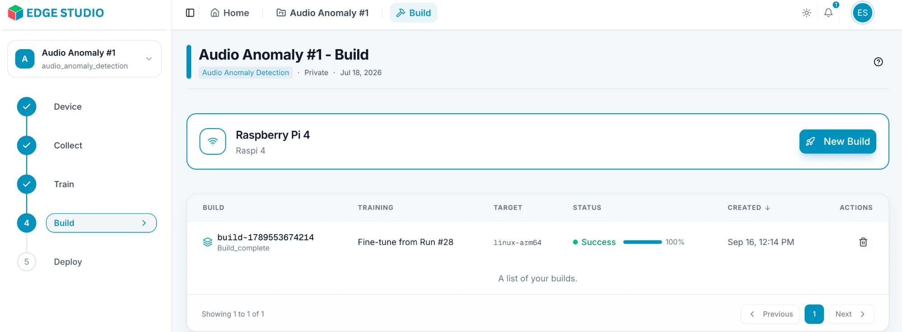
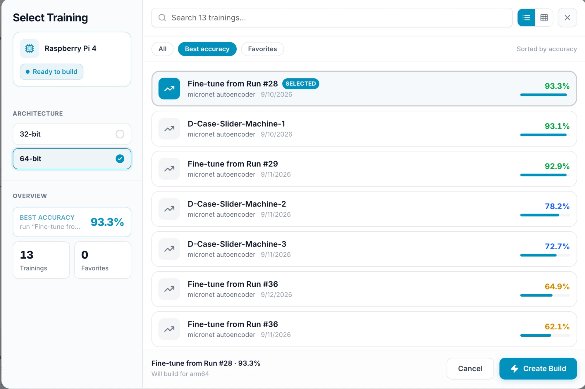

# Build for Your Device

In this step you package a trained model so it can run on your device. Open your project and click **Build** (step 4) in the project menu on the left.

> **Note:** the options in this step can vary with your device and task type. The screens here come from an audio anomaly detection project built for a Raspberry Pi 4.

---

## 1. Click New Build

The Build page shows the device you're building for, with its name and your custom name for it. Click **New Build**.

You need a selected device to build. If the page says **No device selected**, go back to [Create a Device](/docs/create-a-device) and choose **Use Device** first.

Below the button, the list shows your previous builds: the build name, the training it was made from, the target platform (for example `linux-arm64`), its status, and when it was created. Use the trash icon in the **Actions** column to delete a build.

---

## 2. Select a training

The **Select Training** dialog asks which trained model to build.

**On the left:**
- **Your device**, with a **Ready to build** label.
- **Architecture** — for Linux devices, choose **32-bit** or **64-bit**. **64-bit** is selected by default, and some boards support only one option. The dialog confirms your choice at the bottom, for example "Will build for arm64".
- **Overview** — your best accuracy, and how many trainings and favorites you have.

**On the right:**
- Your trainings are listed with their network, date and accuracy score. Search them by name, and switch between the list and grid views.
- Filter with **All**, **Best accuracy** (sorted by accuracy) or **Favorites**. You can mark a run as a favorite from the Training page (see [Train a Model](/docs/train)).
- Click a training to select it. It is marked **SELECTED**, and its name and score appear at the bottom.

Click **Create Build** to start, or **Cancel** to close the dialog.

---

## 3. Wait for the build

Your new build appears in the list, and its status and progress update until it shows **Success** at 100%. Once it succeeds, the model is ready to deploy to your device in the next step, **Deploy**.
