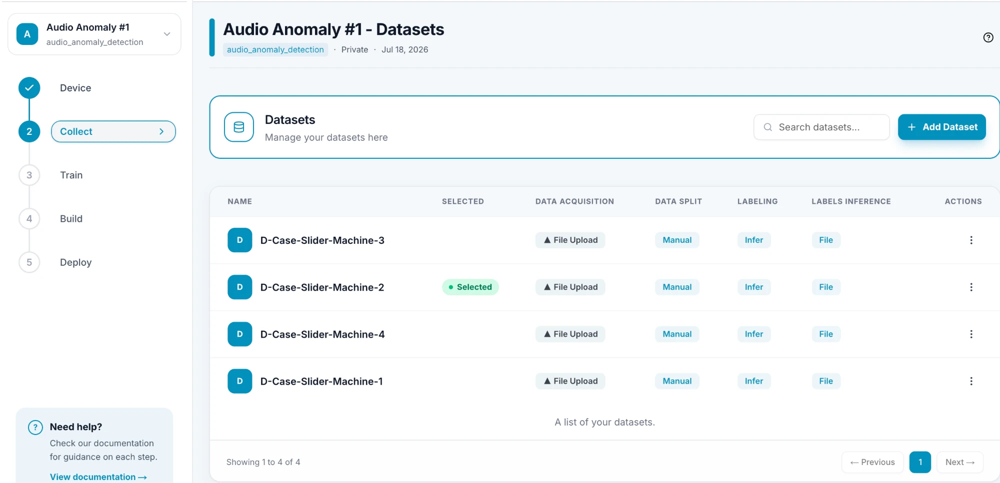
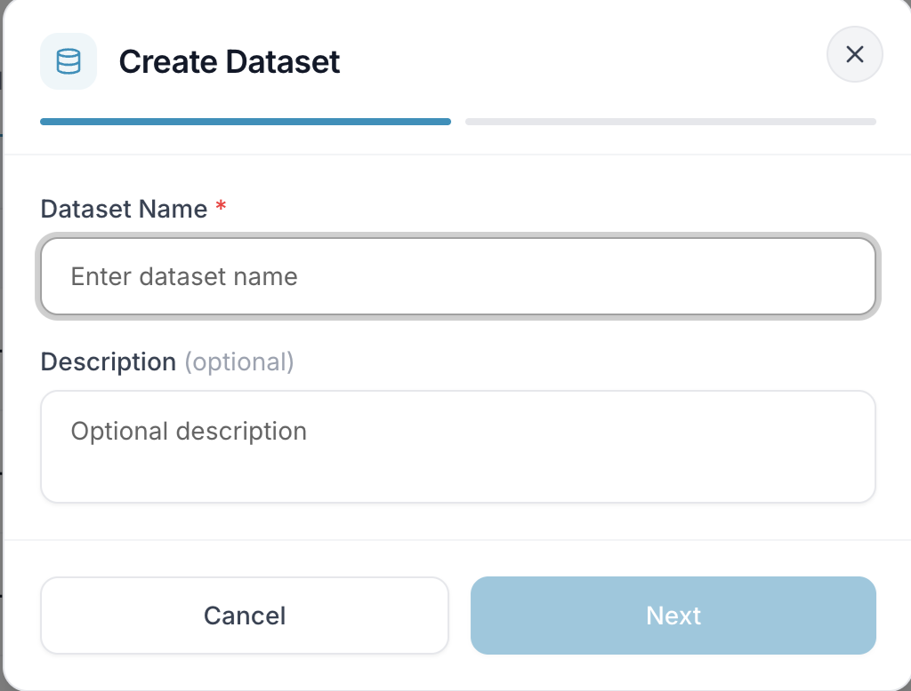
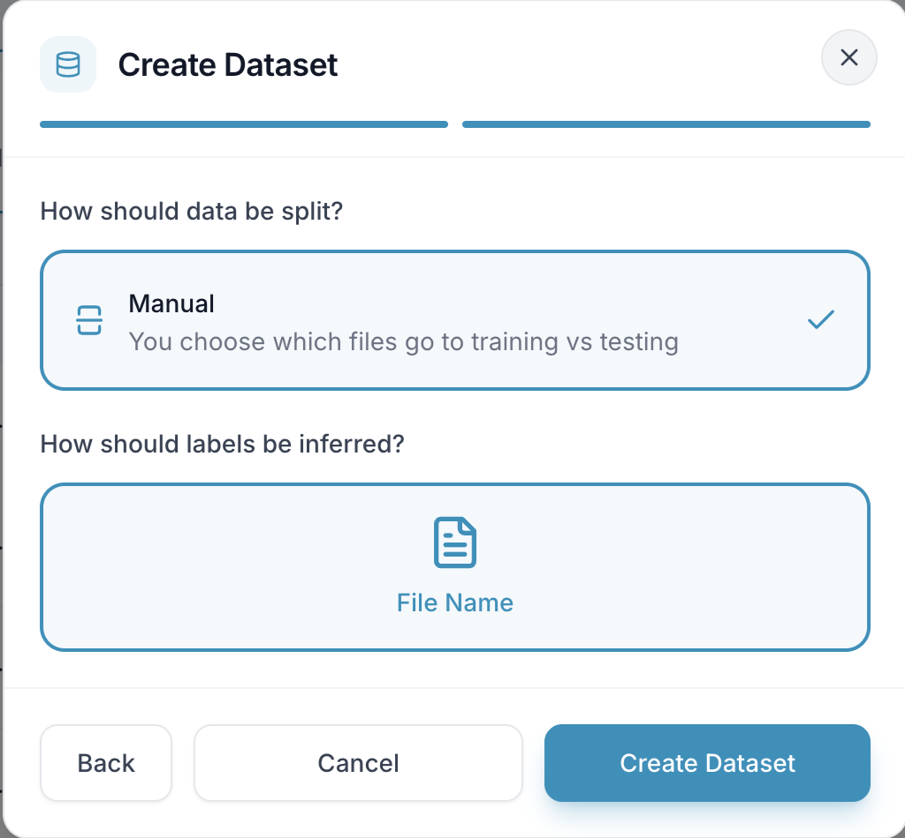
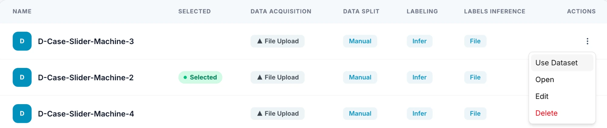
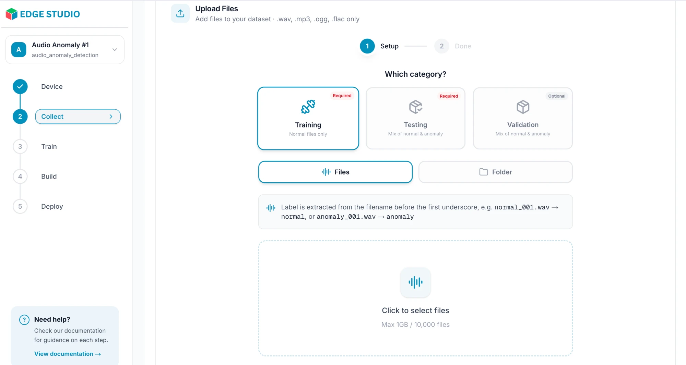

# Collect Data

In this step you bring the data you'll train on into a dataset. Open your project and click **Collect** (step 2) in the project menu on the left.

---

## 1. Click Add Dataset

On the Datasets page, click **Add Dataset**.

---

## 2. Create the dataset

The **Create Dataset** dialog has two steps. First, give the dataset a **Dataset Name** (required) and, if you like, a **Description**, then click **Next**.

Second, choose how your data is organized. The options depend on your project's task type, so follow the steps you see on screen. This example is an audio anomaly detection dataset: the data is split **manually** (you choose which files go to training and which to testing), and each label is inferred from the **file name**. Other task types may offer different choices.

Click **Create Dataset** to finish. Use **Back** to return to the first step, or **Cancel** to close the dialog.

---

## 3. Select your dataset

Your datasets are listed with how each one was set up (data acquisition, data split, labeling and labels inference). **Selecting the right dataset is important:** the **Selected** dataset is the one used by default when you set up training, so check it before you move on.

Open the **⋮** menu in the **Actions** column to manage a dataset:

- **Use Dataset** — select it for your project.
- **Open** — go to its upload page to add files.
- **Edit** — change its details.
- **Delete** — remove it.

---

## 4. Upload your files

Choose **Open** on your dataset to reach the **Upload Files** page. The page adapts to your task type, including the accepted file formats, so follow what you see on screen. In this audio anomaly detection example:

- **Which category?** — pick where the files go. Here, **Training** (required) takes normal files only, **Testing** (required) takes a mix of normal and anomaly files, and **Validation** (optional) takes a mix of normal and anomaly files.
- **Files** or **Folder** — upload individual files, or a whole folder.
- **Label hint** — a note explains how labels are read. Here the label comes from the file name before the first underscore, so `normal_001.wav` is labeled `normal` and `anomaly_001.wav` is labeled `anomaly`.
- **Upload area** — click to select your files. The accepted formats are listed at the top of the page (here `.wav`, `.mp3`, `.ogg`, `.flac`), along with the size limit (here 1 GB and 10,000 files per upload).

When the upload finishes, the page moves to the **Done** step.
