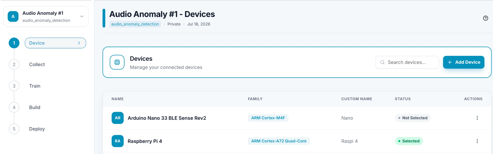
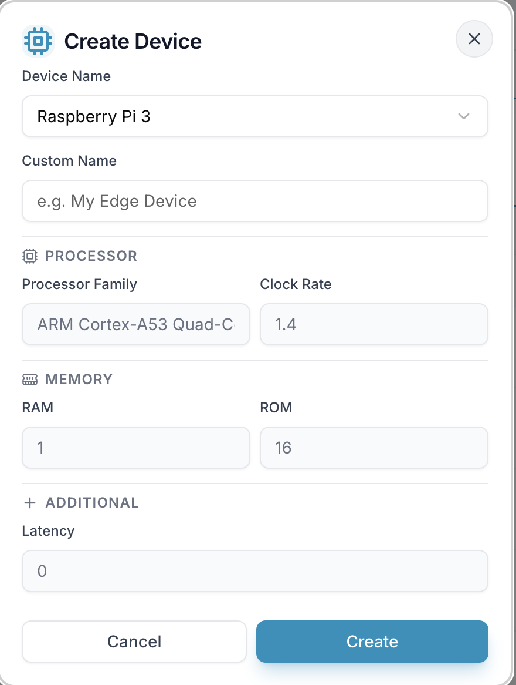
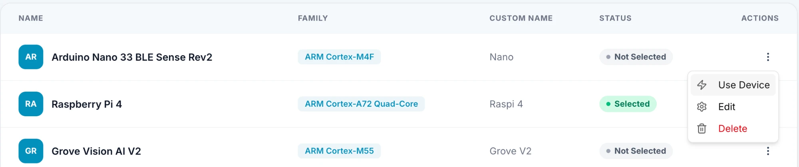

# Create a Device

A device is the edge hardware your model will run on. Add it to your project before you train and deploy.

---

## 1. Click Add Device

Open your project and click **Device** (step 1) in the project menu on the left. On the Devices page, click **Add Device**.

---

## 2. Fill in the Create Device dialog

- **Device Name** — pick your board from the list. If it isn't listed, choose **+ Custom Device** and enter its name.
- **Custom Name** — a name of your choice for this device (up to 50 characters), for example "My Edge Device".
- **Processor**, **Memory** and **Additional** — filled in automatically when you pick a board from the list. For a custom device, enter these yourself.

Click **Create** to add the device, or **Cancel** to close the dialog.

Your plan sets how many devices you can add. If you reach the limit, EdgeStudio tells you so instead of creating the device.

---

## 3. Choose the device to use

Your devices are listed with a status: **Selected** for the device your project uses, **Not Selected** for the others. Open the **⋮** menu in the **Actions** column to manage a device:

- **Use Device** — make it your project's default device.
- **Edit** — change its details.
- **Delete** — remove it.
