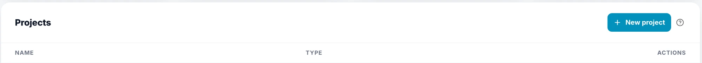
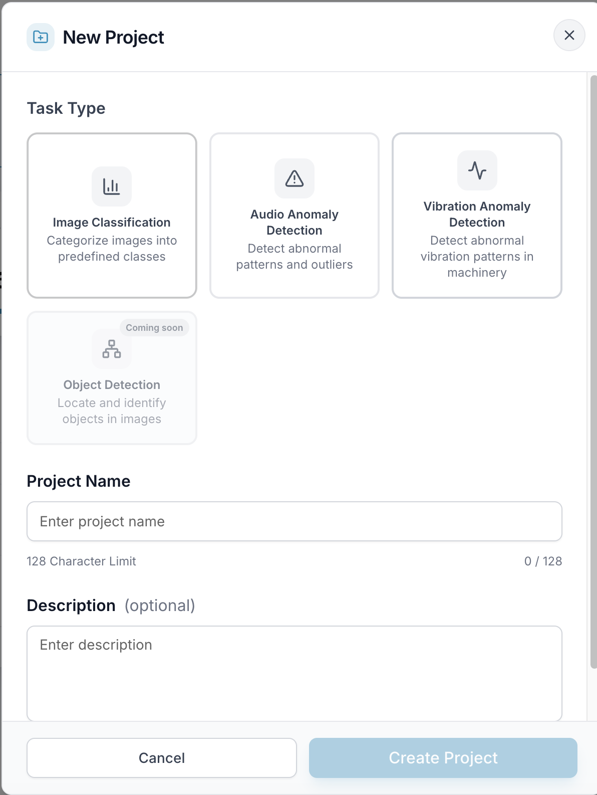

# Create a Project

Everything in EdgeStudio happens inside a project, so creating one is your first step.

---

## 1. Click New project

On the [Dashboard](/docs/dashboard), find the **Projects** card and click **New project**.

The project is created in the workspace you're currently in, **Personal** or an **Organization**, so check the workspace switcher first.

---

## 2. Fill in the New Project dialog

- **Task Type** (required) — choose what you want to build: **Image Classification**, **Audio Anomaly Detection**, or **Vibration Anomaly Detection**. **Object Detection** is coming soon. The task type can't be changed after the project is created.
- **Project Name** (required) — between 3 and 128 characters.
- **Description** (optional) — up to 256 characters.

---

## 3. Click Create Project

**Create Project** becomes available once you've picked a task type and entered a name. Your new project then appears in the **Projects** table. Click it to open it and start working on its [Devices](/docs/devices), [Datasets](/docs/datasets), and [Training](/docs/training).
