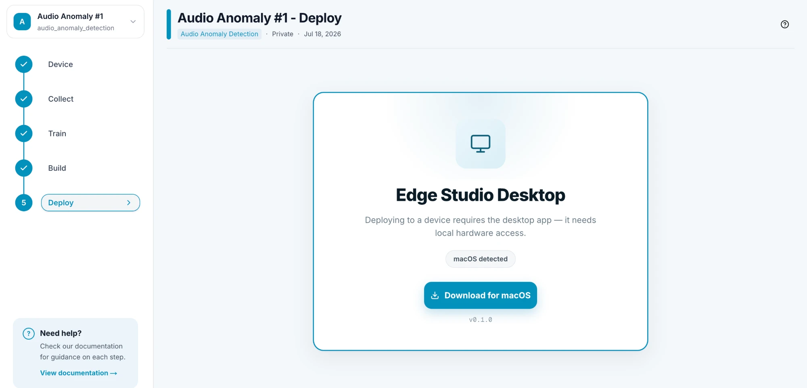

# Deploy to Your Device

This is the last step: sending your build to your device. Open your project and click **Deploy** (step 5) in the project menu on the left. Before you start, make sure you have a successful build (see [Build for Your Device](/docs/build)).

---

## 1. Download the Edge Studio Desktop app

Deploying to a device requires the **Edge Studio Desktop** app, because it needs local access to your hardware. It can't be done from the browser.

The Deploy page detects your operating system (for example **macOS detected**) and offers the matching download, with the app version shown below the button.

The app is available for **Windows**, **macOS** and **Linux**. On Linux you can pick the package for your distribution: Debian / Ubuntu, Fedora / RHEL, Arch Linux, or an AppImage for other distributions. If the app is already installed, the button opens it instead of downloading it again.

---

## 2. Deploy from the desktop app

Use the Edge Studio Desktop app to deploy your build to your device.

> **Coming soon:** documentation for Edge Studio Desktop is on its way. This page will be updated with the deployment steps as soon as it's available.
