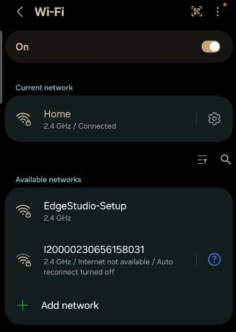
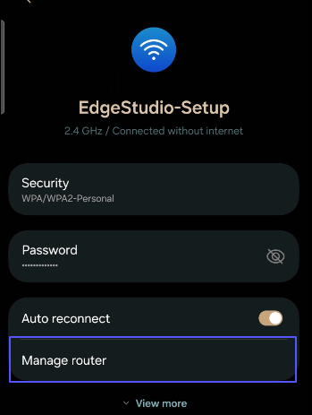
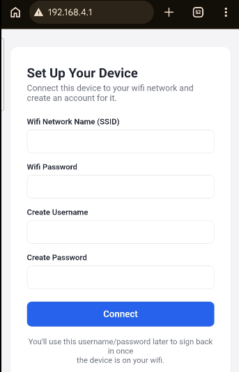
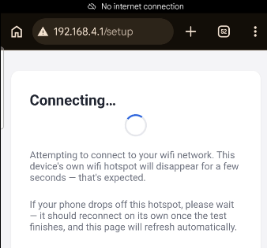
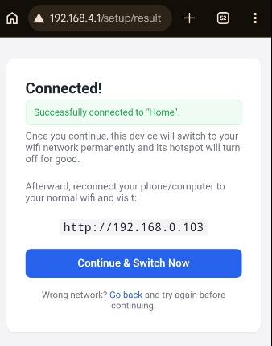
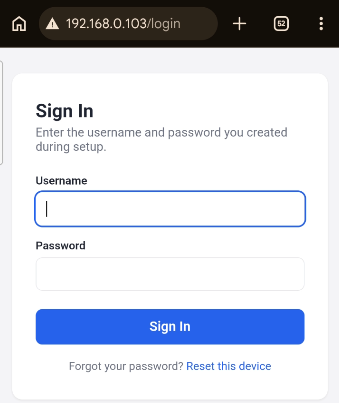
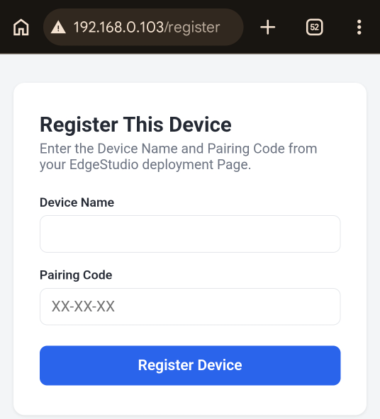

# Setting Up Your EdgeStudio Device

This guide walks you through connecting your EdgeStudio device to your wifi network and registering it to your account. The whole process takes about 5 minutes and is done entirely from your phone's browser — no app installation required.

---

## What You'll Need

- Your device, powered on
- Your home wifi network name and password
- Your Device ID and Device Token (find these on your EdgeStudio Deployment page)
- A phone/computer with wifi 

---

## Step 1: Power On Your Device

Plug in your device and wait about 30 seconds for it to start up. Once ready, it will begin broadcasting its own wifi network `EdgeStudio-Setup` for setup.



---

## Step 2: Connect to the Setup Network

On your phone, open **Settings > Wi-Fi** and look for a network called:

```
Name = EdgeStudio-Setup
Default password = edgestudio123
```

Tap it to connect.

>  **Note**
>  Your phone may warn that this network has "no internet access." That's expected — tap **Connect Anyway** or **Yes** to continue.

---

## Step 3: Open the Setup Page

Within a few seconds, your phone should automatically show a notification like **"Sign in to Wi-Fi network"**. Tap it to open the setup page. If it not shown you can also click on manage router this will open the `Setup page` 



**If the page doesn't open automatically, open your browser and type this link `http://192.168.4.1` and you will see the above page.**

---

## Step 4: Enter Your Wifi Details

Fill in the setup form with:

- **Wifi Network Name (SSID)** — your home wifi's name
- **Wifi Password** — your home wifi's password
- **Username** — choose a username for this device (you'll use it to sign in later)
- **Password** — choose a password for this device

Tap **Connect** when you're done.



> **Remember** 
> The username and password you enter here — you'll need them again in Step 7.

---

## Step 5: Wait While It Connects

Your device will now try connecting to your wifi network. You'll see a **"Connecting…"** screen.



> **Remember**
> During this step, your phone may **disconnected** from the `EdgeStudio-Setup` network. This is normal — your phone should reconnect on its own within a few seconds, if not you need to open wifi and try to connect with `EdgeStudio-Setup` manually. After that page will refresh automatically.

---

## Step 6: Confirm and Switch Over

Once connected, you'll see a success screen showing the IP address your device will use on your home network.



Tap **Continue & Switch Now** to finish. Your device will now switch to your home wifi permanently, and its setup hotspot will turn off.

> **Remeber** 
> Write down or take a screenshot of the IP address shown — you'll need it in the next step.

---

## Step 7: Reconnect and Sign In

1. On your phone, open **Settings > Wi-Fi** and reconnect to your **normal home wifi network**.
2. Open your browser and go to the IP address shown in Step 6, for example:

   ```
   http://192.168.0.103
   ```

3. Sign in using the **username and password** you created in Step 4.



---

## Step 8: Register Your Device

After signing in, enter your **Device ID** and **Device Token**. You can find both of these on your EdgeStudio dashboard.




Tap **Register Device** to finish. Your device is now fully set up and connected to your EdgeStudio account.


---

## Troubleshooting

- **The setup page never appeared after connecting to EdgeStudio-Setup.**
	Open your browser manually and go to `http://192.168.4.1`.

- **"Could not connect" error after entering wifi details.**
	Double-check your wifi password and make sure your device is within range of your router, then try again.

- **My phone didn't reconnect automatically after Step 5.**
	Open Wi-Fi settings and manually reconnect to `EdgeStudio-Setup`, then reopen the setup page.

- **I forgot the username/password I created in Step 4.**
	On the sign-in page, tap **Reset this device**. This will erase all saved settings and let you set up the device again from scratch.

---

## Need Help?

If you run into any issues not covered here, contact EdgeStudio support with your Device ID on hand.
