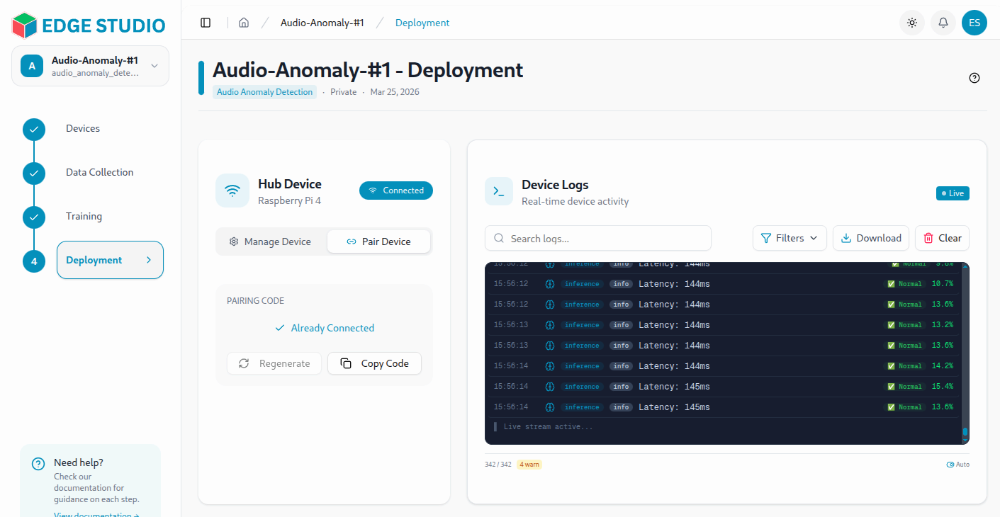
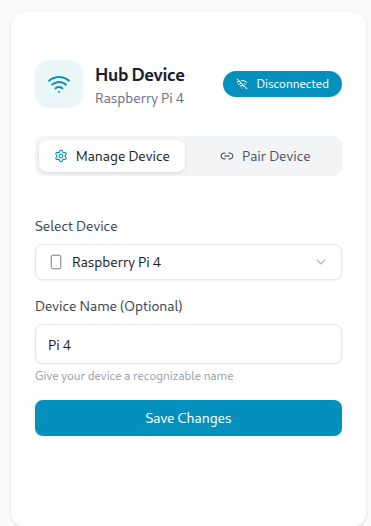
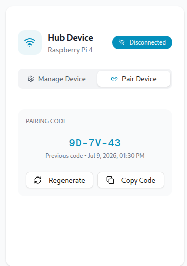
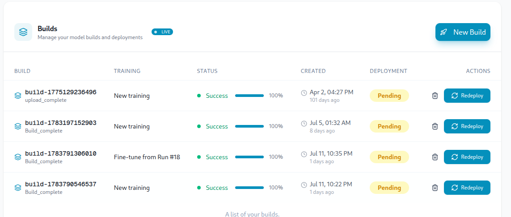
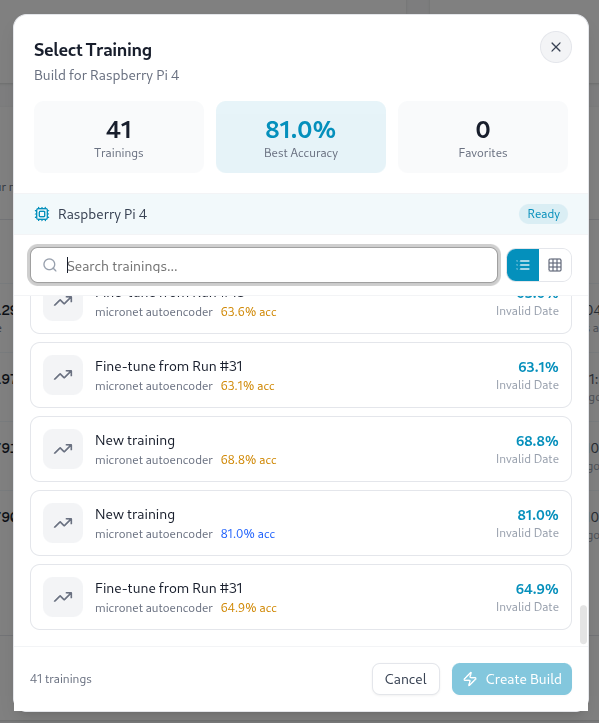
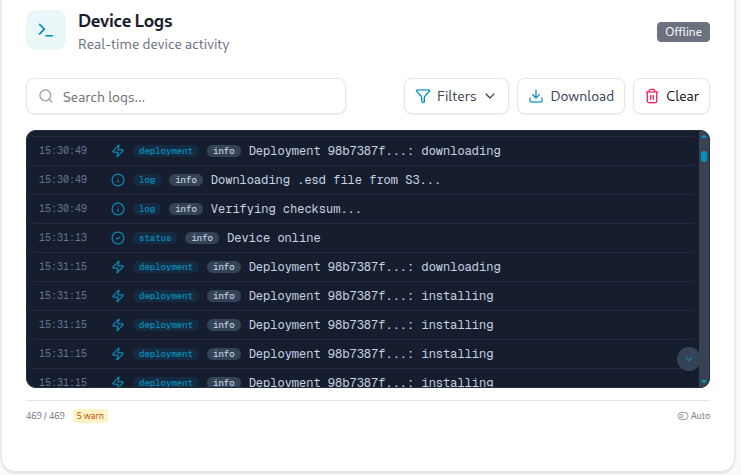
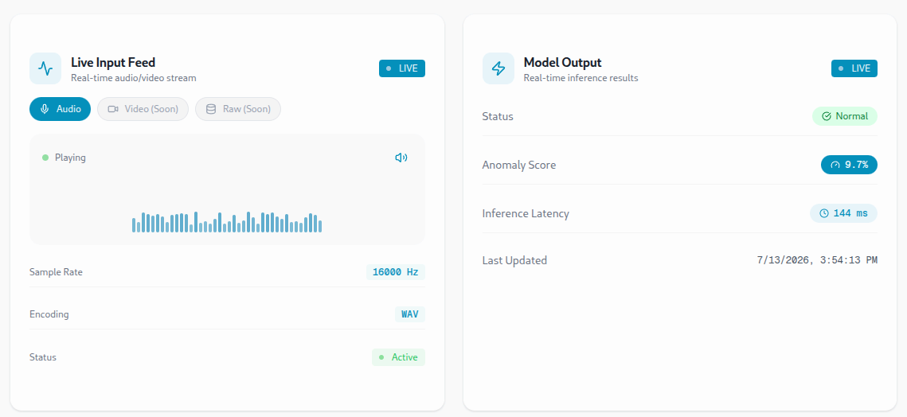
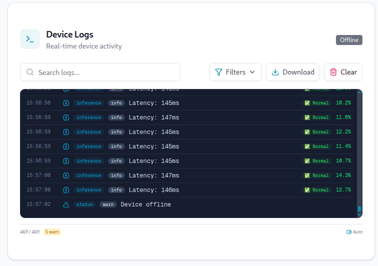

# Build & Deploy

This guide walks you through packaging a trained model and pushing it to a registered EdgeStudio device.

---

## What You'll Need

- A completed training execution you want to deploy (see [Training](/docs/training))
- A device that has completed setup and is registered to your account (see [Setup Device](/docs/deployment/setup-device))

---

## Step 1: Select a Device 

Choose a device which you want to deploy your trained model to.

---

## Step 2: Generate a Pairing Code

Click **Generate Pairing Code** to create a unique code for this deployment. This code will be used to connect your device with dashboard. You need to paste this code in [Here](./setup-device) to complete the device setup.

---

## Step 3: Create a Build

Now click on `New Build` where you find all your trained models. Select anyone of them and  click on `start build`.

---

## Step 4: Deploy the Build

Now click on `Deploy` to deploy the build to your device. You can see the status of the deployment in the `Device logs` section.

---

## Step 5: Inference Running on Device

Once the build is deployed, you can see the inference of the model inside the dashboard. You can also see the status of the device in the `Device logs` section.

---

## Need Help?

If you run into any issues not covered here, contact EdgeStudio support with your Device ID and the execution run number on hand.
