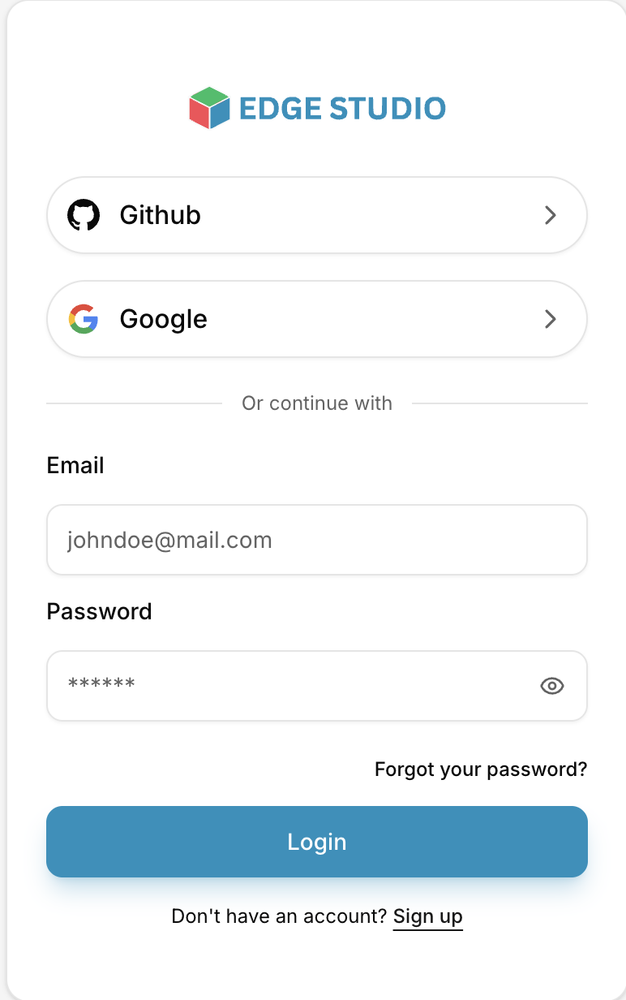
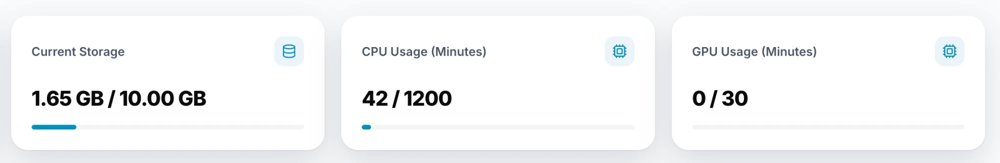

# Before You Start

Before you create your first project, make sure you have two things in place: an EdgeStudio account, and enough compute and storage on your plan.

---

## 1. An EdgeStudio account

You need to be signed in to use EdgeStudio. On the login page you can sign in, or create an account with **Sign up**, using any of these:

- **Email and password**
- **Google**
- **GitHub**

If you signed up with email and forgot your password, use **Forgot your password?** on the login page.

---

## 2. Enough compute and storage

What you can do in EdgeStudio is limited by your plan. The [Dashboard](/docs/dashboard) shows three usage cards, each reading **used / limit**:

- **Current Storage** — the space your data takes up, out of your plan's total (in the example above, 1.65 GB of 10.00 GB).
- **CPU Usage (Minutes)** — the CPU training minutes you've used, out of your plan's allowance (42 of 1200).
- **GPU Usage (Minutes)** — the GPU training minutes you've used, out of your plan's allowance (0 of 30).

Before you start, check that:

- There is enough free storage for the data you plan to upload.
- You have minutes left for the kind of training you plan to run. If your plan has used all its CPU minutes, or has no GPU minutes available, a training run can't start until you upgrade your plan or buy more minutes.

Usage is tracked per workspace, so make sure you're looking at the right one (**Personal** or an **Organization**) with the workspace switcher. To see or change your limits, see [Plans](/docs/dashboard/plans).
