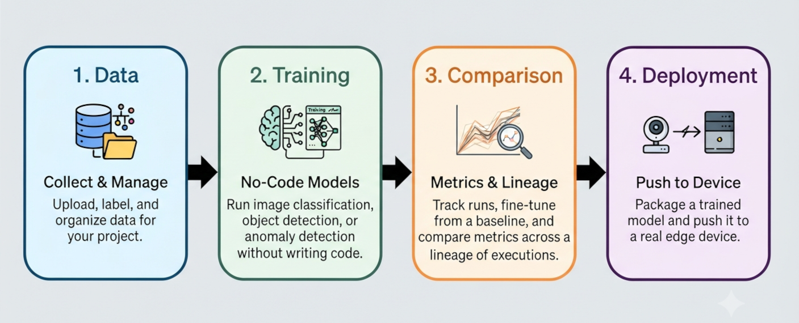

# Welcome to EdgeStudio

EdgeStudio is a no-code platform for building, training, and deploying AI models to edge devices — from data collection all the way to a model running on real hardware.

This documentation covers everything you need to get started, from your first project to a fully deployed model on a physical device.

---

## What You Can Do With EdgeStudio

- **Collect and manage datasets** — upload, label, and organize data for your project.
- **Train models** — run image classification, object detection, or anomaly detection training without writing code.
- **Compare executions** — track runs, fine-tune from a baseline, and compare metrics across a lineage of executions.
- **Deploy to devices** — package a trained model and push it to a real edge device.

---

## Where to Start

If you're new here, head to **[Getting Started](/docs/getting-started)** for a guided walkthrough of your first project.

Otherwise, jump straight to the guide you need:

- **[Devices](/docs/devices)** — connect and manage the hardware you'll deploy to.
- **[Datasets](/docs/datasets)** — bring in and prepare your data.
- **[Training](/docs/training)** — run and monitor training executions.
- **[Deployment](/docs/deployment)** — set up a device and ship a model to it.

---

## Need Help?

If you run into something this documentation doesn't cover, contact EdgeStudio support.
