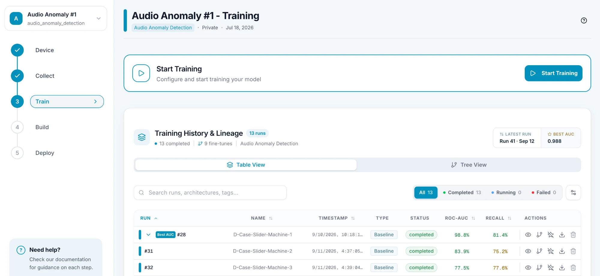
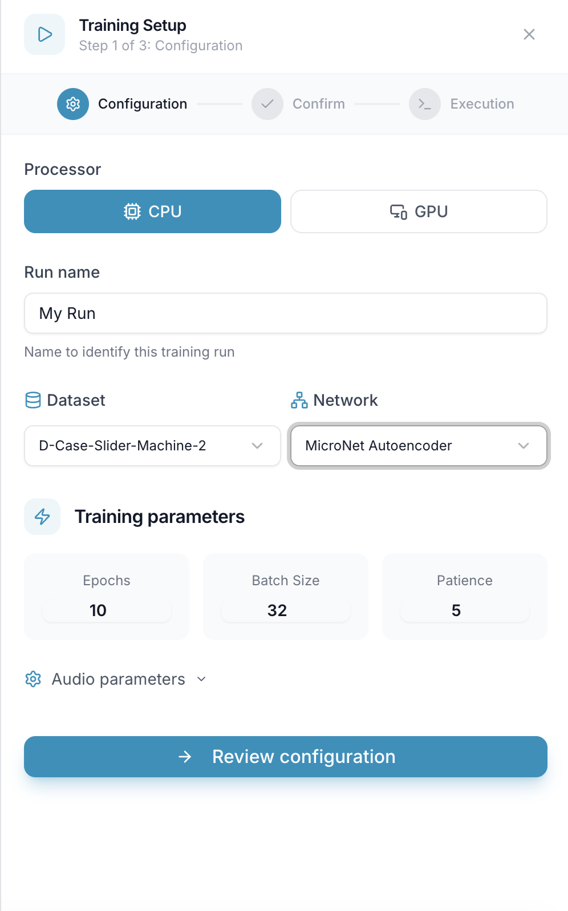
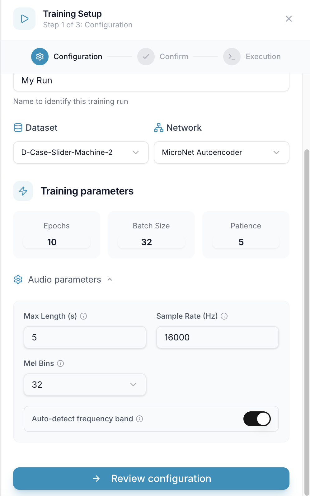
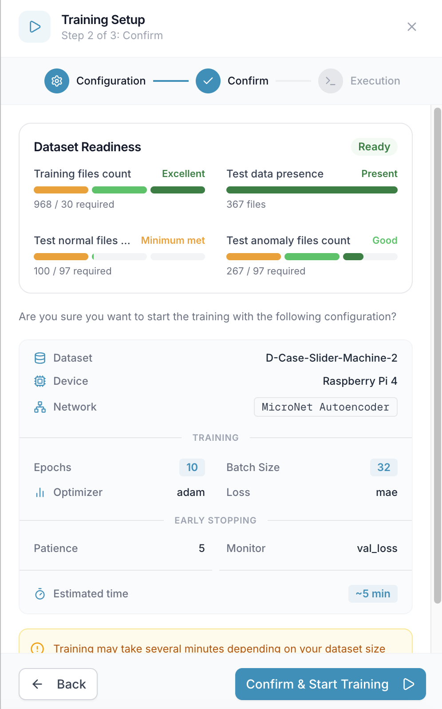
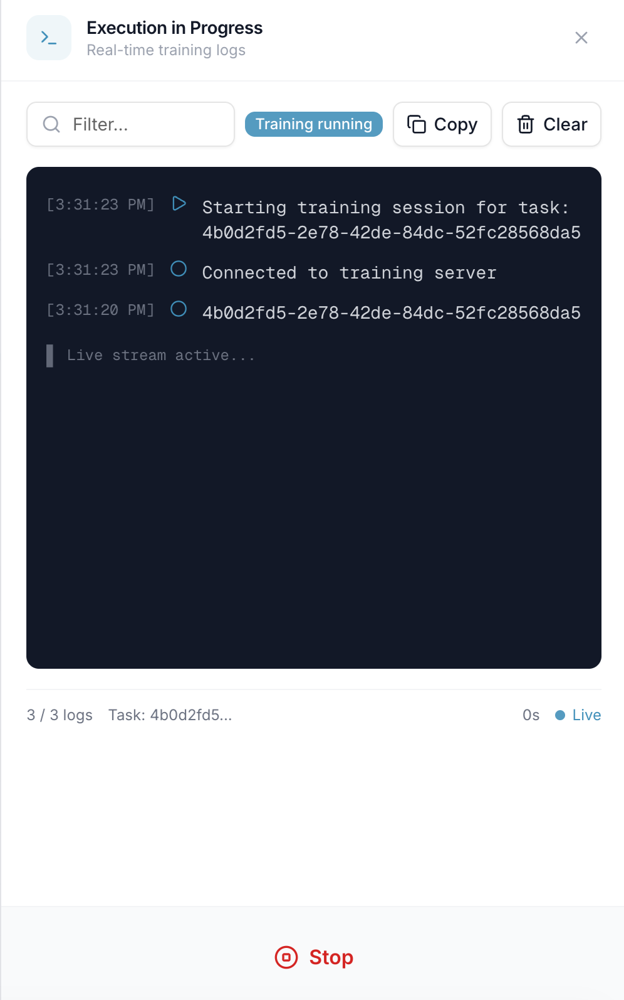
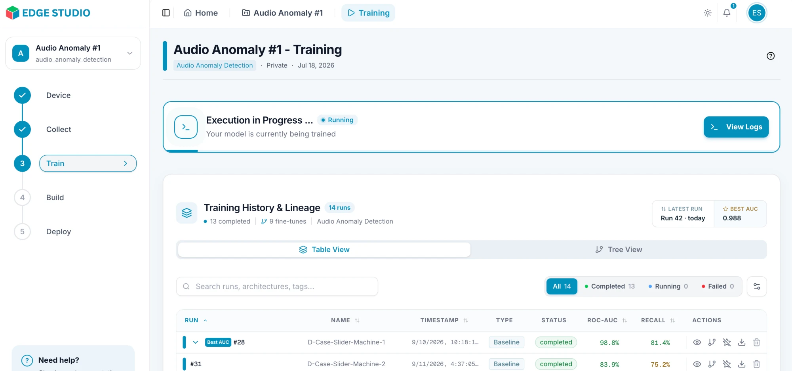
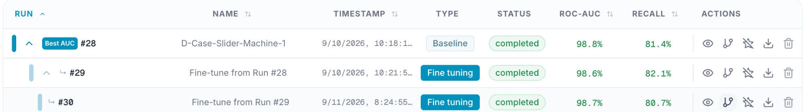
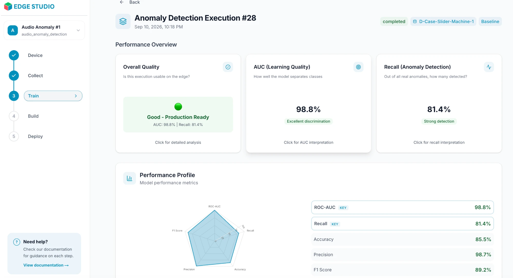

# Train a Model

In this step you train a model on your dataset. Open your project and click **Train** (step 3) in the project menu on the left.

> **Note:** the screens on this page come from an **audio anomaly detection** project. The settings, checks and results you see depend on your project's task type, so use this page as a guide and follow what appears for your own project.

---

## 1. Click Start Training

On the Training page, click **Start Training**. Below it, **Training History & Lineage** lists your past runs (see step 5).

---

## 2. Configure the training

The **Training Setup** dialog has three steps: **Configuration**, **Confirm** and **Execution**. Start with the configuration:

- **Processor** — **CPU** or **GPU**. Training uses your plan's compute minutes (see [Before You Start](/docs/getting-started)).
- **Run name** — a name to identify this run. It's required.
- **Dataset** — the data to train on. It's filled in with your selected dataset.
- **Network** — the model to train (here, MicroNet Autoencoder).
- **Training parameters** — **Epochs**, **Batch Size** and **Patience**. The defaults are a good starting point.
- **Audio parameters** — settings specific to audio. Expand the section to see them:

Here they are **Max Length**, **Sample Rate**, **Mel Bins** and **Auto-detect frequency band**. Click the ⓘ icon next to a setting for an explanation. Other task types show different parameters.

When you're done, click **Review configuration**.

---

## 3. Confirm

For audio anomaly detection, the **Dataset Readiness** panel first checks that your dataset has enough files, such as training files and normal and anomaly test files. Each check shows how it's doing (for example **Minimum met**, **Good** or **Excellent**), and the panel shows **Ready** when you can go ahead.

Below it is a summary of your dataset, device, network, training settings and the estimated time. Click **Back** to change something, or **Confirm & Start Training** to launch the run.

---

## 4. Follow the training

The **Execution** step shows live logs while the model trains.

Use **Filter** to search the logs, **Copy** to copy them, and **Clear** to empty the view. Click **Stop** to cancel the run.

While a run is in progress, the Training page shows **Execution in Progress** with a **View Logs** button to reopen the logs.

---

## 5. Review your results

Finished runs appear in **Training History & Lineage**. Switch between **Table View** and **Tree View**, search runs, and filter by status (**All**, **Completed**, **Running**, **Failed**).

A **Baseline** is a run trained from scratch. A **Fine tuning** run is trained starting from an earlier run, and is shown nested under it. The columns show each run's status and key metrics (here **ROC-AUC** and **Recall**). Use the icons in the **Actions** column to:

- **View details** — open the run's results.
- **Fine-tune** — start a new run from this one.
- **Add to favorites** — mark the run as a favorite.
- **Download PDF** — download a report of the run.
- **Delete** — remove the run.

Open a run with **View details** to see how well it performed:

The **Performance Overview** summarizes the run's overall quality, and how well the model separates normal from anomalous data (**AUC**) and how many real anomalies it detected (**Recall**). The **Performance Profile** below lists all the metrics. The metrics shown depend on the task type.
